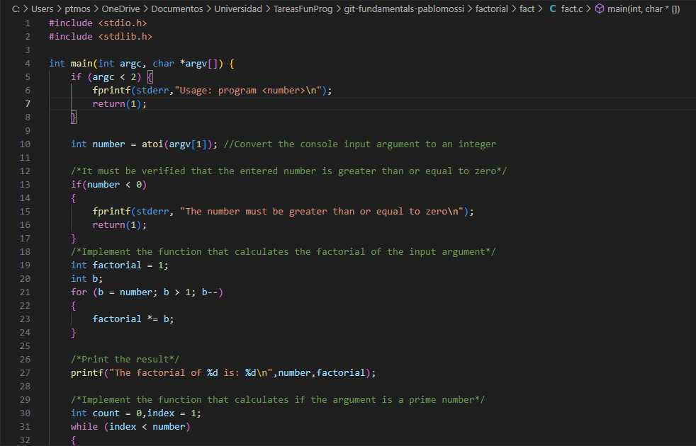

# ProjVec-Eval
Evaluación sobre uso de git para manejo de repositorios. Se espera que el estudiante cree un programa en C y corra unos vectores de prueba. 

#EVALUACIÓN 1
El trabajo que se realizó fue clonar un repositorio desde GitHub hacia mi equipo de computo, el repositorio contiene un archivo que contiene un código en el lenguaje de programación C. Se revisó el código y se corrigieron ciertos errores que contenía con instrucciones que el profesor nos brindó.

[Link](https://markdown.es/sintaxis-markdown/ "Link que lleva a una página que explica como colocar imagenes e hipervínculos")

